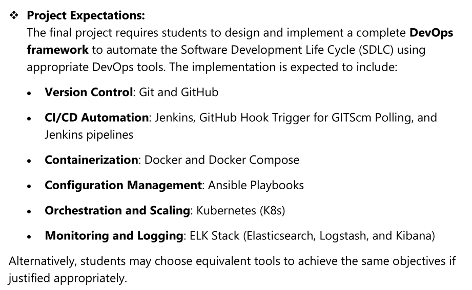
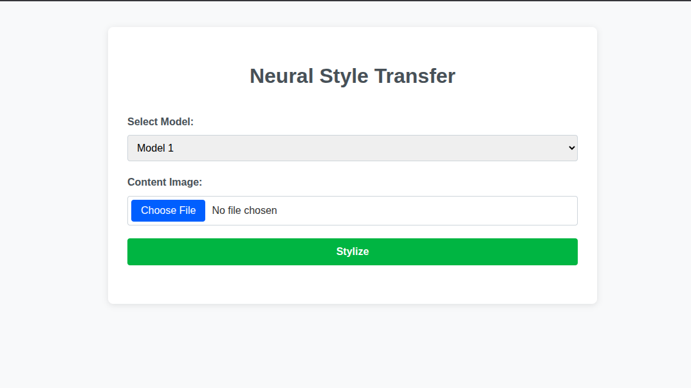
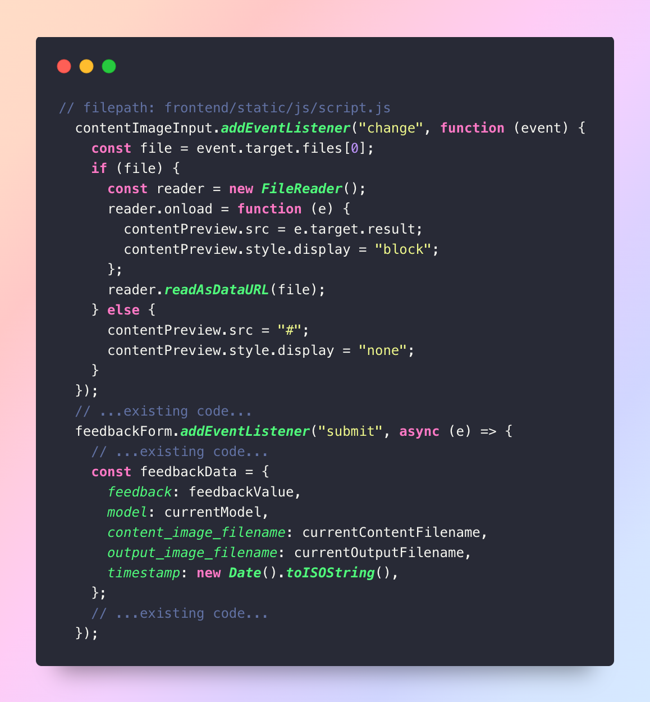
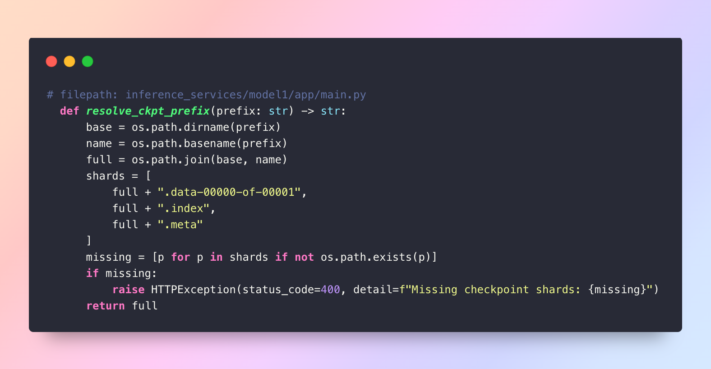
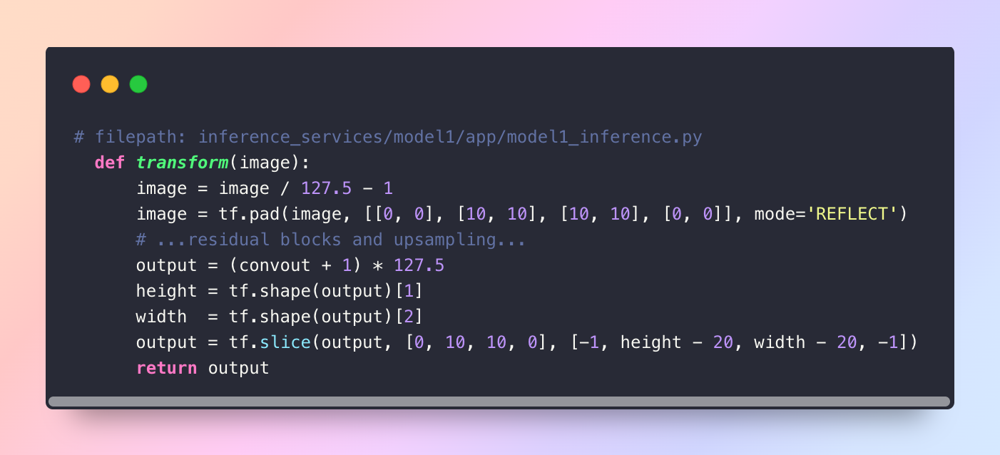
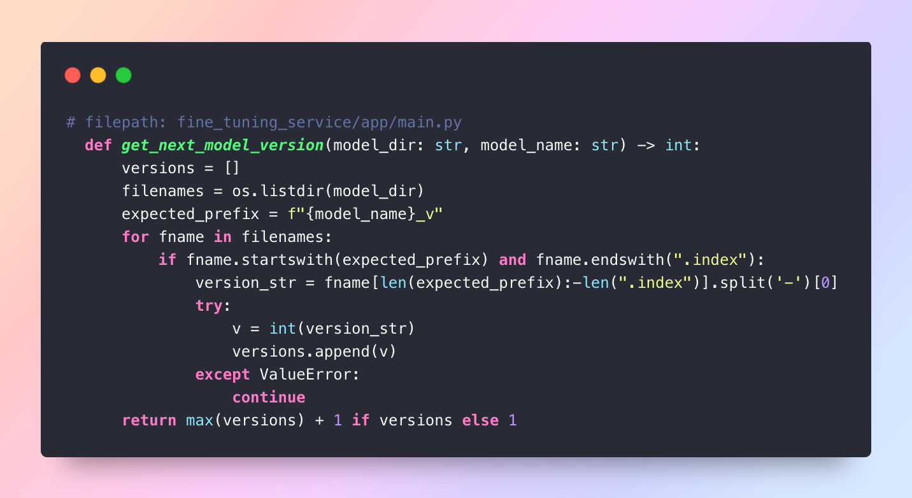
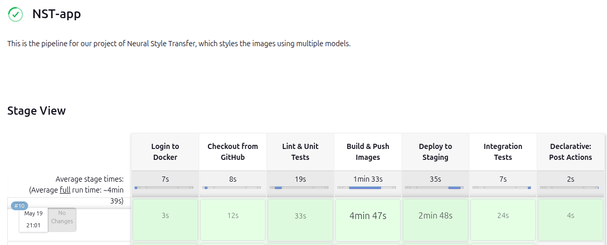
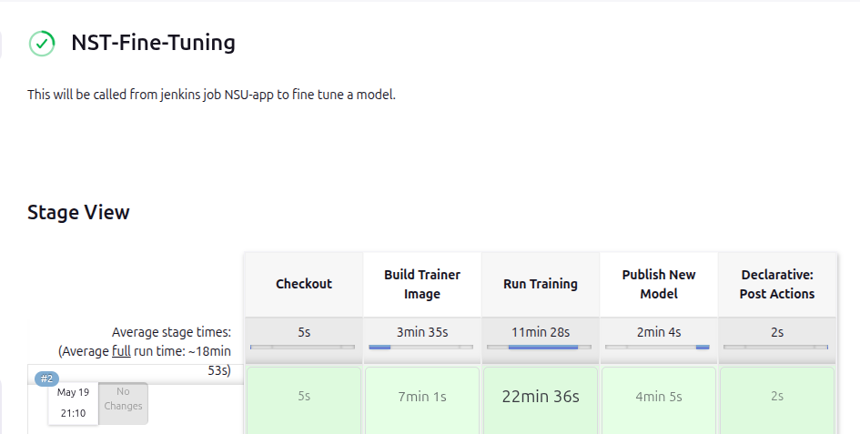

# Title: Neural Style Transfer Web Application: DevOps-Driven MLOps Platform

### Authors

- **Deepanshu Saini MT2024039**
- **Aryan Rastogi MT2024026**

---

### Quick links

- [Gihtub- Neural Style Transfer Application](https://github.com/Deepanshu09-max/NST_app/tree/devops)

---

## **Project Requirements**



---

# Understanding the NST Workflow

This project delivers a **production‑grade, end‑to‑end MLOps platform** for Neural Style Transfer (NST), where users transform their photos into stylized artwork using state‑of‑the‑art deep learning models. The architecture emphasizes **modularity**, **automation**, **scalability**, and **continuous improvement**, powered by a full DevOps toolchain that automates the entire Software Development Life Cycle (SDLC).

---

### DevOps Toolchain & Workflow

- **Version Control:**  
  All code, Kubernetes manifests, and Ansible playbooks live in Git/GitHub, ensuring traceability and pull‑request–driven reviews.

- **CI/CD Automation (Jenkins):**

  - **Lint & Test:** Python linters , JavaScript linters, `pytest` for unit tests, and `yamllint` for manifest validation.
  - **Docker Image Build & Push:** Each microservice (frontend, routing, inference‑model1…4, fine‑tuner) is built as a separate Docker image and pushed to Docker Hub under `deepanshu0903/nst_app:<service-tag>`.
  - **Deploy:** A multi‑stage pipeline applies Kubernetes manifests via `kubectl` and invokes Ansible for production rollouts with zero‑downtime.

- **Containerization:**  
  Services are encapsulated in Docker containers, guaranteeing consistency across development, staging, and production.

- **Configuration Management (Ansible):**

  - Single environment inventory targeting the local Minikube cluster.
  - Playbooks to deploy K8s resources `deploy-k8s.yml`, ELK stack `deploy-elk.yml`, and cleanup.
  - Centralized variables in group_vars/all.yml for Docker registry, image namespace, and manifest paths.

- **Orchestration & Scaling (Kubernetes):**

  - **Deployments & Services:** Each microservice has its own Deployment and ClusterIP Service under `kubernetes/deployments/` and `kubernetes/services/`.
  - **Persistent Volumes (PV/PVC):** Shared `persistent_storage` for model weights, input/output images, and feedback logs.
  - **Ingress Controller:** NGINX Ingress routes `/` and `/static` to the frontend, and `/stylize` & `/feedback` to the routing API.
  - **Horizontal Pod Autoscaler (HPA):** Configurable on inference‑model Deployments to maintain target CPU utilization , enabling dynamic scaling under load.

- **Monitoring & Logging (ELK):**
  - **Elasticsearch:** Stateful single‑node cluster stores all logs under daily indices .
  - **Logstash:** Beats input on port 5044, pipelines logs into Elasticsearch.
  - **Kibana:** Dashboard for real‑time exploration of logs from routing, inference, and fine‑tuning services.
  - **Filebeat DaemonSet:** Collects logs from every node, adds Kubernetes metadata, and ships to Logstash.

---

### Application Architecture

1. **Frontend**

   - **Nginx** serves `index.html`, CSS, and `script.js`.
   - AJAX posts to `/stylize` and `/feedback`, displays images and feedback status.

2. **Routing Service**

   - FastAPI gateway exposes stylize and feedback (JSON).
   - Reads `persistent_storage/models/{model}/latest.txt` to find the current checkpoint.
   - Forwards image + model path to the correct inference-service (`http://inference-service-model2:8000/infer`).
   - Saves stylized output under `persistent_storage/output_images/` and returns base64 JSON payload.

3. **Inference Services**

   - Each model has its own FastAPI app and `modelX_inference.py`.
   - Loads TensorFlow checkpoint from mounted `/persistent_storage/models/modelX`.
   - Writes temporary files to tmp, encodes output, and cleans up.

4. **Fine‑Tuning Service**
   - Listens on triggered via Jenkins Job to retrain models using accumulated feedback in `feedback.jsonl`.
   - Outputs new checkpoints into `persistent_storage/models/modelX/`, updates `latest.txt`, and triggers a rebuild/deploy.

---

### Automated DevOps Workflow

1. **Developer Pushes Code → GitHub**
2. **Jenkins CI**
   - Validates code, builds Docker images, pushes to Docker Hub.
3. **Jenkins CD**
   - Applies K8s manifests via `kubectl apply -f kubernetes/...`.
   - Runs Ansible playbook for production (if flagged).
4. **Kubernetes Rolling Updates**
   - New Pods start before old ones terminate—users experience zero downtime.
5. **ELK & Monitoring**
   - Logs are collected by Filebeat → indexed in Elasticsearch → visualized in Kibana.

---

### Innovation & Continuous Learning

- **Feedback‑Driven Retraining:**  
  User feedback (“good” vs. “bad”) closes the ML loop—when “bad” feedback exceeds a threshold, a secondary Jenkins job launches fine‑tuning, generates new checkpoints, and redeploys without manual intervention.

- **Dynamic Model Routing:**  
  By reading `latest.txt` at request time, the routing service can swap in newly trained models instantly, enabling A/B tests or blue/green style deployments.

---

### Getting Started

- **Local Development**
  ```bash
  # Build & run all services locally
  docker-compose up --build
  # Open http://localhost:8080
  ```

---

# Neural Style Transfer Web Application

## 1. Application Overview

The **Neural Style Transfer (NST) platform** is a fully end‑to‑end system that lets users upload their own photographs and apply one of several deep learning style models—ranging from classical “Udnie” or “Rain Princess” to custom user‑supplied styles. Built for **scalability**, **modularity**, and **continuous delivery**, the platform collects real user feedback to trigger automated model fine‑tuning, ensuring that every iteration of the service delivers richer, more pleasing stylizations.

- **Instant Stylization**  
  Users upload an image via a modern single‑page frontend. A simple dropdown lets them choose among four pre‑trained style models. In under two seconds\*, the routed FastAPI “Routing Service” proxies the request to the correct inference container, which applies the chosen style and returns a Base64‑encoded PNG.
- **Seamless Download & Feedback**  
  Once the stylized image is rendered, users can download it and submit feedback (“good” or “bad”) via the same interface. Feedback is appended to a JSONL file in our shared `persistent_storage` volume.
- **CI/CD & Monitoring**  
  A Jenkins‑driven pipeline builds and pushes Docker images for each microservice (frontend, routing, inference‑models, fine‑tuner), applies Kubernetes manifests, and spins up the entire stack—including ELK logging.
- **Continuous Improvement**  
  When the ratio of “bad” feedback crosses a configurable threshold, a separate Jenkins job invokes the fine‑tuning service in an isolated container. The newly trained weights are persisted back into `persistent_storage/models`, a new Docker image is built, and the main pipeline is automatically retriggered to redeploy with the updated style model.

---

### System Architecture

#### 1. Frontend

**Live Image Preview and Feedback Integration**


- **UI:**
  - Modern, responsive HTML5 interface.
  - Model selector, image upload, live preview, stylized result, and feedback form.
    **Screenshot: NST Web Application Frontend**
- **Styling:**
  - Clean, mobile-friendly design with subtle shadows, rounded corners, and intuitive layout.
- **Client-side Logic:**

  - Handles image preview, AJAX requests for stylization and feedback, result display, and download.
  - Smart error handling and user guidance.

  **Live Image Preview and Feedback Integration**
  

  **Front-End Web Development**

  - The front-end is the user-facing part of the application, responsible for providing an intuitive and interactive experience.
  - Technologies like HTML, CSS, and JavaScript are used to structure content, style the presentation, and handle user interactions.
  - Modern front-end development emphasizes responsiveness, accessibility, and performance.

  **Project Application: Front-End**
  
  

  - The front-end of the NST application is built using HTML, CSS, and JavaScript.
  - Nginx serves these static assets, providing a fast and efficient delivery mechanism.
  - JavaScript handles asynchronous communication with the backend services, enabling a dynamic user experience.

- **Web Server:** [`frontend/nginx.conf`](frontend/nginx.conf)
  - Nginx serves static assets, handles routing, and can be extended for caching and compression.

#### Routing Service

- **API Gateway:**

  - Receives `/stylize` POST: saves input, resolves latest model checkpoint, forwards to the correct inference microservice, saves and returns stylized image.
  - Receives `/feedback` POST: appends feedback JSON to [`persistent_storage/feedback.jsonl`](persistent_storage/feedback.jsonl).
  - Handles errors gracefully, logs all steps, and manages persistent storage directories.

  **Innovative Snippet: Dynamic Model Routing and Checkpoint Resolution**
  

  **General Concept: API Gateways**

  - An API gateway acts as a single entry point for all client requests, decoupling the front-end from the backend services.
  - It handles routing, authentication, authorization, rate limiting, and other cross-cutting concerns.
  - API gateways improve security, simplify client development, and enable easier evolution of backend services.

  **Project Application: Routing Service**

  - The Routing Service acts as an API gateway for the NST application.
  - It receives requests from the front-end, routes them to the appropriate inference service, and returns the results.
  - This design allows for easy addition or removal of inference services without affecting the front-end.

- **Smart Model Routing:**
  - Dynamically discovers the latest model checkpoint for each style model.
  - Forwards requests to the correct inference service using Kubernetes service DNS.

#### Inference Microservices

- **Each Model (1–4):**

  - FastAPI app ([`main.py`](inference_services/model1/app/main.py), etc.).
  - `/infer` POST: receives content image and model checkpoint path, runs style transfer, returns base64-encoded stylized image and filename.
  - Uses model-specific inference logic (e.g., `model1_inference.py`).
  - Containerized for isolated, scalable deployment.

  **Innovative Snippet: Robust TensorFlow Checkpoint Loading and Inference**
  

  **General Concept: Microservices**

  - Microservices are a software development approach where an application is structured as a collection of small, autonomous services, modeled around a business domain.
  - Each service is independently deployable, scalable, and maintainable.
  - Microservices enable faster development cycles, improved fault isolation, and greater technology diversity.

  **Project Application: Inference Microservices**

  - The NST application uses microservices for each style model.
  - This allows each model to be deployed and scaled independently, optimizing resource utilization.
  - It also enables easier experimentation with new models without affecting the entire application.

  - **Model Architecture:**
    - Deep residual convolutional neural networks, trained for fast style transfer.
    - TensorFlow 1.x compatible, with custom layers and instance normalization.

  **Innovative Snippet: Efficient Image Transformation Network**
  

  **Inference and Results**

  **Input Image**
  

  **Stylized outputs by the models**

  | Model   | Style Image                   | Output Image                |
  | ------- | ----------------------------- | --------------------------- |
  | Model 1 |  |  |
  | Model 2 |  |  |
  | Model 3 |  |  |
  | Model 4 |  |  |

#### Fine-Tuning Service

- **Feedback Loop:**

  - Consumes [`persistent_storage/feedback.jsonl`](persistent_storage/feedback.jsonl) for user feedback.
  - Training logic in [`main.py`](fine_tuning_service/app/main.py) and [`training_utils.py`](fine_tuning_service/app/training_utils.py).
  - Accepts fine-tuning requests (model, epochs, batch size, weights, etc.), validates data, launches background training, manages model versioning and checkpointing.
  - Updates `latest.txt` in model directories for routing/inference services.

  **Automated Model Versioning and Checkpoint Management**
  

  **General Concept: Continuous Learning and Fine-Tuning**

  - Machine learning models often require continuous learning and fine-tuning to maintain accuracy and adapt to new data.
  - Fine-tuning involves training a pre-trained model on a smaller, task-specific dataset to improve its performance on that specific task.
  - This approach is more efficient than training a model from scratch and can lead to better results.

  **Project Application: Fine-Tuning Service**

  - The Fine-Tuning Service enables continuous improvement of the NST models.
  - User feedback is used to curate training data, which is then used to fine-tune the models.
  - This feedback loop ensures that the models are constantly adapting to user preferences and producing high-quality stylized images.

- **Robust Validation:**
  - Ensures all images are valid RGB, style image is present, and VGG weights are available before training.

#### Data Storage

- **Image Volumes:**
  - `persistent_storage/input_images/`: uploaded content images.
  - `persistent_storage/output_images/`: stylized outputs.
- **Model Checkpoints:**
  - `persistent_storage/models/model*/`: versioned TensorFlow checkpoints, `latest.txt`, and style images.
- **VGG Weights:**
  - `persistent_storage/vgg19.npz`: required for perceptual loss in training.
- **Feedback Log:**
  - `persistent_storage/feedback.jsonl`: newline-delimited JSON, append-only, for auditability and ML curation.

---

## 2. DevOps & CI/CD

### Docker

- **General Concept: Containerization with Docker**

  - Think of Docker as creating a portable “shipping container” for each microservice in our NST platform. Each container bundles:
    - The service’s application code (FastAPI, JS, Python scripts, etc.)
    - A specific Python runtime (3.9-slim-buster)
    - All required libraries (`requirements.txt`)
    - Any OS‑level dependencies (e.g. `libopencv` for image processing)
    - A predefined entrypoint (`uvicorn main:app …` for FastAPI, `nginx -g daemon off;` for the frontend)
  - Once built, the same container image runs identically on your laptop, in Minikube, or in a cloud Kubernetes cluster—eliminating “works on my machine” issues.

- **Base ML Image:**

  - **Purpose:** Share a common foundation across all NST inference and fine‑tuning services.
  - **Contents:**
    ```dockerfile
    FROM python:3.9-slim-buster
    WORKDIR /app
    COPY base_requirements.txt .
    RUN pip install --no-cache-dir -r base_requirements.txt
    ```
  - **Usage:**  
    In each `inference_services/model*/Dockerfile` and `fine_tuning_service/Dockerfile`, we start FROM `docker.io/deepanshu0903/nst_app:base-ml` to avoid reinstalling large ML frameworks repeatedly.

- **Service‑Specific Dockerfiles:**

  - **Inference Services**
    - `FROM deepanshu0903/nst_app:base-ml` :
    - Copy FastAPI app code into `/app`, install model‑specific dependencies via `requirements.txt`, expose port `8000`, and launch with `uvicorn main:app --host 0.0.0.0 --port 8000`.
  - **Fine‑Tuning Service**
    - Builds on the same ML base image, includes TensorFlow training scripts (`training_utils.py`), exposes port `8001` (for manual training triggers), and runs via `uvicorn`.
  - **Routing Service**
    - Built FROM Python 3.9-slim, installs `requests`, `fastapi`, writes logs to `/var/log/app/app.log`, exposes port `8000`.
  - **Frontend**
    - `FROM nginx:alpine`, copies `index.html`, `static/` and `nginx.conf` into `/usr/share/nginx/html` and `/etc/nginx/nginx.conf`, respectively.

- **Docker Compose for Local Development:** `docker-compose.yml`

  - **Services Defined:**
    - `frontend` on port `8080`
    - `routing-service` (FastAPI) on port `8000`
    - Four `inference-service-modelX` containers on ports `8001–8004`
    - `fine-tuning-service` on port `8005`
  - **Volumes & Networking:**
    - Mount host directory `./persistent_storage:/persistent_storage` into each service, so all containers share the same input images, model checkpoints, and feedback log.
    - A user can run:
      ```bash
      docker-compose up --build
      ```
      and immediately access the app at `http://localhost:8080`, stylize images, and view logs under `persistent_storage`.

- **Image Naming & Tagging Strategy:**
  - We push each service image to Docker Hub under our namespace `deepanshu0903/nst_app:` with tags:
    - `frontend`
    - `routing-service`
    - `inference-model1`, …, `inference-model4`
    - `fine-tuning-service`
  - This tag scheme maps directly to Kubernetes Deployment YAMLs, simplifying manifests and rollbacks.

---

These Docker and CI/CD specifics ensure that every change to our codebase—be it a new style model, a Frontend tweak, or an updated training script—flows automatically through testing, containerization, and deployment, culminating in a production‑ready update within minutes.

**Multi-Service Docker Compose for Local ML Development**


**Running the Services via Docker Compose (Step-by-Step)**

1.  **Install Docker and Docker Compose:**

    - Think of Docker as the engine that runs your application packages (containers). Docker Compose is a tool that lets you define and manage multiple containers as a single application.
    - **On macOS:** Download Docker Desktop from the official Docker website and follow the installation instructions. Docker Compose is included.
    - **On Windows:** Download Docker Desktop from the official Docker website and follow the installation instructions. Docker Compose is included. Ensure that you enable WSL 2 during installation if prompted.
    - **On Linux:** Follow the instructions on the Docker website for your specific distribution to install Docker Engine and Docker Compose separately.

2.  **Navigate to the Project Root:**

    - Open a terminal (command prompt or PowerShell on Windows) and use the `cd` command to navigate to the root directory of the NST project. This is the folder that contains the `docker-compose.yml` file.
    - Example: `cd /Users/aryanrastogi/college/spe/NST_Major/neural-style-transfer`

3.  **Start the Services:**

    - Run the following command to start all the services defined in `docker-compose.yml`:

      ```bash
      docker-compose up --build
      ```

      - `docker-compose up`: This command tells Docker Compose to start the services defined in the `docker-compose.yml` file.
      - `--build`: This flag tells Docker Compose to build the Docker images for any services that have a `build` section in the `docker-compose.yml` file. This is necessary the first time you run the application or when you make changes to the Dockerfiles.

4.  **Monitor the Startup:**

    - Observe the terminal output to monitor the startup process of each service. Docker Compose will display logs from each container as they start.
    - Wait until you see messages indicating that each service has started successfully (e.g., "Uvicorn running on ...").

5.  **Access the Application:**

    - Once all services are running, access the application by opening your web browser and navigating to `http://localhost:8080`. This will direct you to the frontend service.
    - `localhost` refers to your own computer. `8080` is the port number that the frontend service is configured to listen on (as defined in `docker-compose.yml`).

6.  **Access the Services Directly (for Debugging):**

    - You can access individual services directly for debugging or testing purposes:

      - Frontend: `http://localhost:8080`
      - Routing Service: `http://localhost:8000`
      - Inference Model 1: `http://localhost:8001`
      - Inference Model 2: `http://localhost:8002`
      - Inference Model 3: `http://localhost:8003`
      - Inference Model 4: `http://localhost:8004`
      - Fine-Tuning Service: `http://localhost:8005`

7.  **Stop the Services:**

    - To stop the services, run the following command in the same terminal:

      ```bash
      docker-compose down
      ```

      - This command will stop and remove the containers, networks, and volumes created by `docker-compose up`.
      - It's a clean way to shut down the application and free up resources.

### **Kubernetes**

- **General Concept: Container Orchestration with Kubernetes**

- Kubernetes (often shortened to K8s) is like a conductor for an orchestra of containers. It automates the deployment, scaling, and management of your containerized applications. Think of it as a platform that makes sure your application is always running as you intended, even if individual containers fail or need to be scaled up to handle more traffic. Kubernetes handles tasks like:

  - **Scheduling:** Deciding where to run your containers.
  - **Scaling:** Automatically increasing or decreasing the number of containers based on demand.
  - **Self-healing:** Restarting failed containers and replacing them automatically.
  - **Service discovery:** Allowing containers to find and communicate with each other.
  - **Rolling updates:** Updating your application without downtime.

- **Deployments:**

- [`kubernetes/deployments/`](kubernetes/deployments/): Deploys each service with resource requests/limits, volume mounts, and health checks.
- **In Detail:** Kubernetes Deployments are declarative specifications for how to create and update instances of your application. They ensure that a specified number of pod replicas are running at any given time. If a pod fails, the Deployment automatically replaces it. In our NST app, each microservice (Frontend, Routing, Inference Models, Fine-Tuning) is deployed as a separate Deployment.

- **Services:**

- [`kubernetes/services/`](kubernetes/services/): Exposes each deployment as a ClusterIP service for internal communication.
- **In Detail:** Kubernetes Services provide a stable IP address and DNS name for accessing a set of Pods. They act as a load balancer, distributing traffic across the healthy Pods in a Deployment. We use ClusterIP Services for internal communication between our microservices.

- **Ingress:**

- [`kubernetes/ingress/ingress.yaml`](kubernetes/ingress/ingress.yaml): (empty, but intended for HTTP(S) routing, TLS termination, and path-based routing).
- **In Detail:** An Ingress exposes HTTP and HTTPS routes from outside the cluster to Services within the cluster. It acts as a reverse proxy and load balancer. While the file is currently empty, it's intended to handle TLS termination (HTTPS) and route traffic to the Frontend and Routing services based on URL paths.

- **Persistent Volumes:**

- [`kubernetes/persistent-volumes/pv.yaml`](kubernetes/persistent-volumes/pv.yaml), [`pvc.yaml`](kubernetes/persistent-volumes/pvc.yaml): Shared storage for models, images, and feedback.
- **In Detail:** Persistent Volumes (PVs) and Persistent Volume Claims (PVCs) provide a way to manage persistent storage in a Kubernetes cluster. PVs are cluster-wide resources that represent physical storage, while PVCs are requests for storage by users. Our NST app uses a PVC (`nst-pvc`) to request storage for models, images, and feedback data, ensuring that this data persists even if pods are restarted or rescheduled.

- **NetworkPolicies:**

- **In Detail:** Kubernetes NetworkPolicies control traffic flow at the IP address or port level (OSI layer 3 or 4). They allow you to specify rules for which pods can communicate with each other. Implementing NetworkPolicies is a crucial security best practice for limiting the blast radius of potential security breaches.

- **Monitoring & Logging:**

- **ELK:** [`kubernetes/elk/`](kubernetes/elk/): Elasticsearch, Logstash, Kibana, Filebeat manifests for centralized logging.

**Innovative Snippet: Persistent Volume Claim for Model and Data Sharing**


**Running the Application using Kubernetes (Step-by-Step)**

1.  **Install kubectl:**

- `kubectl` is the command-line tool for interacting with your Kubernetes cluster.
- **On macOS:** `brew install kubectl` (if you have Homebrew installed)
- **On Windows:** Download the `kubectl` binary from the Kubernetes website and add it to your PATH.
- **On Linux:** Follow the instructions on the Kubernetes website for your specific distribution.

2.  **Configure kubectl:**

- `kubectl` needs to be configured to connect to your Kubernetes cluster. This typically involves setting the `KUBECONFIG` environment variable or placing a configuration file in `~/.kube/config`.
- The specific configuration steps depend on your Kubernetes provider (e.g., Minikube, Google Kubernetes Engine, Amazon EKS, Azure Kubernetes Service). Follow the instructions provided by your provider.

3.  **Install Ansible:**

- Ansible is an automation tool that we'll use to deploy the application to Kubernetes.
- **On macOS:** `brew install ansible` (if you have Homebrew installed)
- **On Windows:** Install Python and pip, then run `pip install ansible`.
- **On Linux:** Use your distribution's package manager (e.g., `apt install ansible` on Debian/Ubuntu).

4.  **Configure Ansible:**

- Ansible needs to be configured to connect to your Kubernetes cluster. This typically involves setting up SSH access to a node in the cluster or using a Kubernetes API token.
- The specific configuration steps depend on your Kubernetes provider.

5.  **Navigate to the Ansible Playbooks Directory:**

- Open a terminal and navigate to the `ansible/playbooks` directory in the NST project.

6.  **Run the Umbrella Playbook:**

- Execute the `umbrella-playbook.yml` playbook to deploy the entire application stack:

  ```bash
  ansible-playbook umbrella-playbook.yml -i inventory.ini
  ```

  - `ansible-playbook`: This command tells Ansible to run the specified playbook.
  - `umbrella-playbook.yml`: This is the main playbook that orchestrates the deployment of the application.
  - `-i inventory.ini`: This flag specifies the inventory file, which contains information about the target Kubernetes cluster. You may need to create or modify this file based on your cluster setup.

7.  **Monitor the Deployment:**

- Observe the terminal output to monitor the deployment process. Ansible will display the status of each task as it executes.
- Pay attention to any errors or warnings that may occur.

8.  **Verify the Deployment:**

- Once the playbook has completed, verify that all the services are running correctly by checking the status of the deployments and pods:
  

  - `kubectl get deployments`: This command lists all the deployments in the Kubernetes cluster.
  - `kubectl get pods`: This command lists all the pods in the Kubernetes cluster.
  - Ensure that all deployments have the desired number of replicas and that all pods are in the `Running` state.

9.  **Access the Application:**

- To access the application, you need to determine the external IP address or hostname of the Ingress controller. The exact steps depend on your Kubernetes provider.
- **Minikube:** `minikube service list`
- **Cloud Providers (GKE, EKS, AKS):** Check the Ingress resource in your cloud provider's console or use `kubectl get ingress`.
- Once you have the external IP address or hostname, open it in your web browser to access the application.

10. **Access Kibana:**

- Similarly, determine the external IP address or hostname of the Kibana service and access the Kibana dashboard in your web browser.

### **ELK Stack Logging**

To achieve centralized, real‑time log collection and inspection across all NST microservices, we have integrated the ELK stack (Elasticsearch, Logstash, Kibana) with Filebeat as a DaemonSet. Here’s how it all fits together:

### 1. Filebeat (Log Shipper)

- **DaemonSet Deployment**
  - Runs one Filebeat pod on each Kubernetes node.
  - **Autodiscover** mode watches `/var/log/containers/*.log` on the host and uses Kubernetes metadata to annotate each log entry with `pod`, `namespace`, `container`, and `labels`.
  - **ConfigMap** supplies:
    ```yaml
    filebeat.autodiscover:
      providers:
        - type: kubernetes
          node: ${NODE_NAME}
          hints.enabled: true
    processors:
      - add_kubernetes_metadata: { in_cluster: true }
    output.logstash:
      hosts: ["logstash.elk.svc.cluster.local:5044"]
    ```
  - **Mounts** hostPath `/var/log/containers` and the `filebeat.yml` from the ConfigMap.

### 2. Logstash (Log Parser & Router)

- **Deployment** (`kubernetes/elk/logstash-deployment.yaml`)
  - Exposes port **5044** to receive beats.
  - **Pipeline Config** is provided via a ConfigMap (`logstash-pipeline`):
    ```conf
    input { beats { port => 5044 } }
    filter {
      # (Optional) Add filters to parse JSON, drop health-check logs, or tag by service
    }
    output {
      elasticsearch {
        hosts => ["http://elasticsearch:9200"]
        index => "nst-logs-%{+YYYY.MM.dd}"
      }
    }
    ```
  - Logstash enriches each event (e.g., timestamp, log level) and writes to Elasticsearch indices prefixed `nst-logs-`.

### 3. Elasticsearch (Log Storage & Search)

- **Single‑Node Deployment**
  - Runs a single replica with `discovery.type=single-node` for simplicity.
  - Stores and indexes incoming JSON log documents under daily indices (`nst-logs-2025.05.19`, etc.).
  - **Service** (`elasticsearch-service.yaml`) exposes port **9200** within the cluster.

### 4. Kibana (Log Visualization)

- **Deployment**
  - Connects to the Elasticsearch service at `elasticsearch:9200`.
  - **Service** (`kibana-service.yaml`) exposes port **5601**.
  - Developers can port‑forward:
    ```bash
    kubectl port-forward svc/kibana 5601:5601 -n elk
    ```
    and then open [http://localhost:5601](http://localhost:5601) to:
    - **Discover**: search logs by pod name, severity, timestamp, or text.
    - **Dashboard**: build custom visualizations (error rates per service, request latencies, etc.).
    - **Alerts**: configure thresholds (e.g., error spikes) to notify via email or Slack.

---

### How It Works End‑to‑End

1. **Application Pods** (routing, inference, fine‑tuner) write structured logs to **stdout** or to a file under `/var/log/app/app.log`.
2. **Filebeat** DaemonSet on each node automatically picks up all container logs, enriches them with Kubernetes metadata, and forwards them to Logstash.
3. **Logstash** applies any parsing, filtering, or enrichment (e.g., dropping health-check noise), then indexes the logs into Elasticsearch.
4. **Kibana** provides a powerful UI to explore, filter, and visualize these logs in real time—allowing you to trace a user’s stylization request from front‑end upload, through routing, to inference service execution and feedback storage.

### **Ansible**

- **General Concept: Infrastructure as Code (IaC) with Ansible**

  - Infrastructure as Code (IaC) is the practice of managing and provisioning infrastructure through machine-readable definition files, rather than manual configuration.
  - Ansible is an automation tool that simplifies IaC by using a declarative language to define the desired state of the infrastructure.
  - IaC enables repeatable, consistent, and auditable infrastructure deployments.

- **Inventory & Group Vars:**
  - [`ansible/inventory.ini`](ansible/inventory.ini) (not shown, but implied), [`ansible/group_vars/all.yml`](ansible/group_vars/all.yml): Cluster and registry config.
- **Playbooks:**

  - [`ansible/playbooks/cleanup.yml`](ansible/playbooks/cleanup.yml): Removes all K8s resources for a clean slate.
  - [`ansible/playbooks/deploy-k8s.yml`](ansible/playbooks/deploy-k8s.yml): Deploys core app to K8s.
  - [`ansible/playbooks/deploy-elk.yml`](ansible/playbooks/deploy-elk.yml): Deploys ELK stack.
  - [`ansible/playbooks/umbrella-playbook.yml`](ansible/playbooks/umbrella-playbook.yml): Orchestrates full deployment.

  **Innovative Snippet: One-Click Full Stack Deployment**

  ```yaml
  # filepath: ansible/playbooks/umbrella-playbook.yml
  ---
  - import_playbook: cleanup.yml
  - import_playbook: deploy-k8s.yml
  - import_playbook: deploy-elk.yml
  ```

### CI/CD Pipeline

- **General Concept: Continuous Integration and Continuous Delivery (CI/CD)**

  - CI/CD is a set of practices that automate the build, test, and deployment of software changes.
  - Continuous Integration (CI) ensures that every code change is automatically built and tested, catching issues early.
  - Continuous Delivery (CD) automates the release of tested code to production-like environments, enabling rapid and reliable deployments.

#### Main Pipeline: NST_App

The main Jenkins pipeline orchestrates the entire DevOps lifecycle for the NST platform. Here’s how it works, step by step:

1. **Checkout:**  
   The pipeline begins by securely fetching the latest code from the GitHub repository. This ensures that every build operates on the most recent version of the codebase, enabling traceability and reproducibility.

2. **Lint & Tests (Parallelized):**  
   Code quality is paramount. The pipeline runs Python linting (`flake8`) and frontend linting (`npm run lint`) to enforce style and catch common errors. Simultaneously, it executes unit tests for all Python services (`pytest`) and validates all Kubernetes YAML manifests (`yamllint`). Running these checks in parallel speeds up feedback for developers and helps maintain a healthy codebase.

3. **Build & Push Images:**  
   Once the code passes all checks, Docker images are built for each microservice (frontend, routing, inference, fine-tuning). These images are then pushed to DockerHub using secure credentials, ensuring that deployments always use the latest, tested containers.

4. **Deploy to Staging:**  
   The pipeline applies all Kubernetes manifests to the staging cluster using `kubectl`. This step leverages Jenkins credentials for secure access and ensures that the application is deployed in a production-like environment for further validation.

5. **Smoke Test:**  
   To verify that the deployment was successful, the pipeline performs a health check by querying the `/health` endpoint via the Kubernetes Ingress. This quick test ensures that the core services are up and running before proceeding.

6. **Feedback-Driven Fine-Tuning:**  
   The pipeline automatically monitors user feedback by counting the number of `"bad"` feedback entries in `feedback.jsonl`. If the count exceeds a configurable threshold (e.g., 5), it triggers the dedicated FineTuneModels pipeline to retrain the models. This closes the ML loop, ensuring that the models continuously improve based on real user input.

7. **Deploy to Production:**  
   For maximum safety, production deployment is gated behind a parameter. When enabled, the pipeline runs an Ansible playbook to deploy the latest images to the production environment, ensuring a controlled and auditable release process.

8. **Cleanup:**  
   After every run, the pipeline prunes unused Docker images to keep the build agents clean and efficient.
   

**Why this design?**  
This pipeline is crafted for speed, safety, and continuous improvement. By parallelizing checks, automating deployments, and integrating feedback-driven retraining, it enables rapid iteration while maintaining high reliability. The use of secure credentials, parameterized production deploys, and automated cleanups reflects best practices in modern DevOps.

---

#### Fine-Tuning Pipeline: FineTuneModels

The FineTuneModels Jenkins job is a specialized, parameterized pipeline designed to trigger model fine-tuning on demand—either automatically (from the main pipeline) or manually by developers. Here’s how it works:

1. **Checkout:**  
   The pipeline starts by fetching the latest code from GitHub, ensuring that the fine-tuning process uses the most up-to-date training logic and configurations.

2. **Trigger Fine-Tuning Service:**  
   The heart of this pipeline is a POST request to the fine-tuning service’s `/finetune` endpoint. All relevant parameters—such as model name, epochs, batch size, image size, learning rate, style/content weights, and the service URL—are passed dynamically. This enables flexible, reproducible, and auditable fine-tuning runs.

3. **Publish Trigger Info:**  
   For transparency and traceability, the pipeline logs which model was requested for fine-tuning and which build triggered the process. This is invaluable for audit trails and debugging.

4. **Post Actions:**
   - **On Success:**  
     If fine-tuning succeeds, the pipeline can (optionally) re-trigger the main NST_App pipeline. This ensures that the newly fine-tuned model is immediately integrated into the deployment workflow, closing the loop from feedback to improved production models.
   - **On Failure:**  
     If anything goes wrong, an email notification is sent to the relevant stakeholders, including a link to the build logs for rapid troubleshooting.
   - **Always:**  
     Regardless of outcome, the pipeline logs completion, ensuring that every run is accounted for.
     

**Why this design?**  
This pipeline empowers both automation and developer-driven experimentation. By parameterizing every aspect of the fine-tuning process, it supports rapid iteration, reproducibility, and easy integration with the main CI/CD flow. The ability to automatically re-trigger the main pipeline ensures that improvements are quickly propagated to users, while robust notifications and logging keep the team informed.

---

> _“Upon refreshing the application, the new changes should be visible seamlessly.”_  
> Thanks to Kubernetes rolling‐update strategy and loosely coupled microservices, each new Docker image or updated ConfigMap deploys with zero downtime. Users never lose connectivity during a release.

**In summary:**  
These Jenkins pipelines embody the principles of modern MLOps: automation, feedback-driven improvement, traceability, and developer empowerment. They ensure that every code change, model update, and user feedback cycle is seamlessly integrated into a robust, production-grade workflow—delivering better models, faster, and with confidence.

---

## 3. Network & Security

- **TLS Termination:**
  - Should be handled at Ingress (see [`kubernetes/ingress/ingress.yaml`](kubernetes/ingress/ingress.yaml)), with Let's Encrypt or custom certificates.
- **NetworkPolicies & RBAC:**
  - Only allow routing service to talk to inference pods.

---

## 4. Scalability & Resilience

- **Load Balancing:**
  - K8s Services provide internal load balancing; Ingress for external.
- **Service Discovery:**
  - K8s DNS for service-to-service communication (e.g., `http://inference-service-model1:8000`).
- **Data Persistence:**
  - All critical data (models, images, feedback) stored on shared PVC, ensuring no data loss on pod restarts.
- **Fault Tolerance:**
  - Example:
    ```groovy
    docker.build("deepanshu0903/nst_app:inference-model1", "inference_services/model1")
          .push()
    ```
  - Pod restarts, readiness/liveness probes, persistent storage, and stateless service design.

---

## 5. Appendix

### Full Directory Tree (Summary)

```
.
├── ansible
│   ├── ansible.cfg
│   ├── inventory.ini
│   └── playbooks
├── docker
│   └── base-tf
│       ├── Dockerfile
│       └── requirements-base.txt
├── docker-compose.yml
├── execute-in-cluster.sh
├── fine_tuning_service
│   ├── app
│   ├── Dockerfile
│   └── requirements.txt
├── frontend
│   ├── Dockerfile
│   ├── index.html
│   ├── nginx.conf
│   ├── package-lock.json
│   └── static
│       ├── css
│       │   └── style.css
│       └── js
│           └── script.js
├── inference_services
│   ├── model1
│   │   ├── app
│   │   ├── Dockerfile
│   │   └── requirements.txt
│   ├── model2
│   │   ├── app
│   │   ├── Dockerfile
│   │   └── requirements.txt
│   ├── model3
│   │   ├── app
│   └── model4
│       ├── Dockerfile
│       └── requirements.txt
├── jenkins
│   ├── Jenkinsfile
│   └── Jenkinsfile-fine-tuning
├── kubernetes
│   ├── debug-pod.yaml
│   ├── deployments
│   ├── elk
│   ├── ingress
│   │   └── ingress.yaml
│   ├── monitoring
│   ├── network-policies
│   │   └── allow-routing-to-inference.yaml
│   ├── persistent-volumes
│   │   ├── pvc.yaml
│   │   └── pv.yaml
│   └── services
├── persistent_storage
│   ├── data
│   ├── feedback.jsonl
│   ├── input_images
│   │   └── tree_sunset.jpg
│   ├── models
│   │   ├── model1
│   │   ├── model2
│   │   ├── model3
│   │   └── model4
│   ├── output_images
│   │   └── stylized_tree_sunset_fc92cc6b-tree_sunset.png
│   └── vgg19.npz
└── routing_service
    ├── app
    ├── Dockerfile
    └── requirements.txt

```

### Microservice Summary Table

| Name                    | Port | Dockerfile Path                      | Endpoints               | Description                  |
| ----------------------- | ---- | ------------------------------------ | ----------------------- | ---------------------------- |
| **Frontend**            | 80   | frontend/Dockerfile                  | `/`                     | Static UI via Nginx          |
| **Routing Service**     | 8000 | routing_service/Dockerfile           | `/stylize`, `/feedback` | API gateway, feedback logger |
| **Inference Model 1**   | 8000 | inference_services/model1/Dockerfile | `/infer`                | NST inference (model 1)      |
| **Inference Model 2**   | 8000 | inference_services/model2/Dockerfile | `/infer`                | NST inference (model 2)      |
| **Inference Model 3**   | 8000 | inference_services/model3/Dockerfile | `/infer`                | NST inference (model 3)      |
| **Inference Model 4**   | 8000 | inference_services/model4/Dockerfile | `/infer`                | NST inference (model 4)      |
| **Fine-Tuning Service** | 8000 | fine_tuning_service/Dockerfile       | `/finetune`, `/health`  | Model training/fine-tuning   |

---

**By incorporating these elements, the report will not only be more comprehensive and visually appealing, but also more accessible and engaging for a wide range of readers—from engineers to stakeholders and newcomers to DevOps/ML.**
